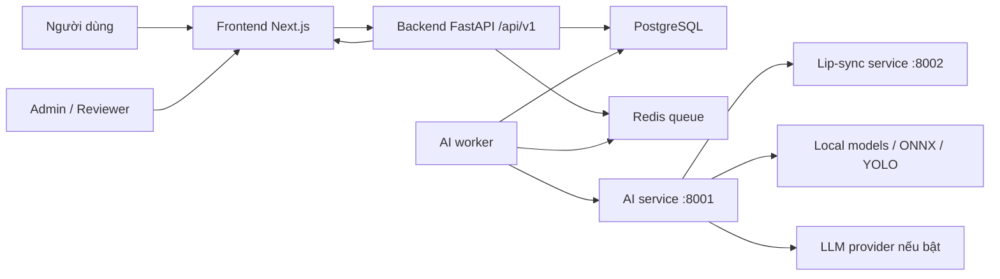
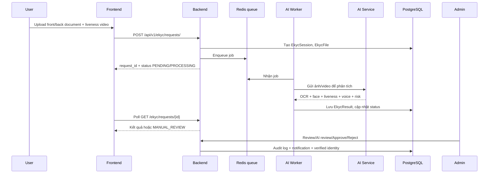

# Báo cáo tổng thể hệ thống hiện tại

**Dự án:** C2-App-036 - Hệ thống eKYC tích hợp AI  
**Ngày lập báo cáo:** 08/07/2026  
**Phạm vi:** Frontend, Backend, AI modules, worker, cơ sở dữ liệu, triển khai, bảo mật, kiểm thử và các điểm cần hoàn thiện trước bàn giao.

---

## 1. Tóm tắt điều hành

Hệ thống hiện tại là một nền tảng eKYC theo kiến trúc full-stack, gồm:

- **Frontend Next.js** phục vụ người dùng và admin/reviewer.
- **Backend FastAPI** quản lý tài khoản, xác thực, hồ sơ eKYC, trạng thái xử lý, duyệt thủ công, thông báo và audit log.
- **AI service FastAPI** xử lý OCR giấy tờ, nhận diện khuôn mặt, đối chiếu giấy tờ với video/selfie, liveness, deepfake, lip-sync, speech-to-text/voice challenge và risk scoring.
- **AI worker** xử lý job bất đồng bộ qua Redis queue.
- **PostgreSQL** lưu user, session eKYC, kết quả, danh tính đã xác minh, audit log, notification.
- **Redis** làm hàng đợi xử lý eKYC.
- **Lip-sync microservice** dùng SyncNet, chạy riêng ở port 8002 khi bật kiểm tra khẩu hình.

Trạng thái tổng quan:

- Phần **AI core** đã được kiểm tra lại trong phiên này: `195 passed, 1 warning`.
- Model readiness AI báo `ready=true`, OCR ready, ONNX MiniFASNet/deepfake available, speech enabled, ffmpeg available.
- Frontend lint đã chạy thành công bằng `npm --prefix code/frontend run lint`.
- Backend/API đã được đọc và tổng hợp theo source hiện tại; chưa chạy full backend test trong phiên này vì cần môi trường Postgres/Redis hoặc Docker compose.
- Script AI log đã được sửa để chịu được file JSON log hỏng đuôi và batch theo dung lượng, tránh lỗi server `HTTP 413`.

Kết luận bàn giao ngắn:

- Hệ thống đã có đủ khung sản phẩm eKYC end-to-end: user upload giấy tờ/video, backend tạo request, worker/AI xử lý, admin review, approve/reject, ghi audit và notification.
- Phần AI đã ở mức có thể bàn giao kiểm thử nội bộ.
- Trước production cần xác nhận lại môi trường Docker full stack, secrets thật, endpoint lip-sync, SMTP/email, OAuth providers và test dữ liệu thật đa dạng hơn.

---

## 2. Mục tiêu hệ thống

Hệ thống hướng tới việc tự động hóa quy trình xác minh danh tính điện tử:

1. Người dùng đăng ký/đăng nhập.
2. Người dùng upload ảnh giấy tờ tùy thân mặt trước/mặt sau và video liveness.
3. Hệ thống trích xuất thông tin giấy tờ bằng OCR + layout model + rule parser + LLM review.
4. Hệ thống đối chiếu ảnh chân dung trên giấy tờ với khuôn mặt trong video.
5. Hệ thống kiểm tra liveness, deepfake, replay/camera injection, lip-sync và voice challenge.
6. Hệ thống trả kết quả tự động hoặc đưa vào manual review.
7. Admin/reviewer xem hồ sơ, nhận gợi ý AI review, chỉnh field OCR nếu cần, approve/reject và ghi audit log.

---

## 3. Kiến trúc tổng thể

### 3.1 Thành phần chính

| Thành phần | Công nghệ | Port mặc định | Vai trò |
|---|---:|---:|---|
| Frontend | Next.js, React, TypeScript, Tailwind, lucide-react | 3060 | Giao diện user, eKYC flow, dashboard, admin |
| Backend | FastAPI, SQLModel, Alembic, JWT | 8000 | API chính, auth, eKYC session, admin, queue |
| AI modules | FastAPI, RapidOCR, YOLO layout, InsightFace, ONNX, LLM | 8001 | OCR, biometric, liveness, risk, voice |
| Lip-sync service | FastAPI, SyncNet | 8002 | Kiểm tra khẩu hình/audio bất thường |
| PostgreSQL | Postgres | 5432 | Database chính |
| Redis | Redis 7 | 6379 | Queue xử lý OCR/eKYC |
| AI worker | Python worker | N/A | Consume queue, cập nhật DB |

### 3.2 Sơ đồ luồng tổng quát



### 3.3 Luồng eKYC end-to-end



---

## 4. Frontend hiện tại

### 4.1 Công nghệ

- Next.js App Router.
- React + TypeScript.
- Tailwind CSS.
- Icons: `lucide-react`.
- Animation: `framer-motion`.
- Camera/face support: `@mediapipe/tasks-vision`.
- API client tự viết trong `code/frontend/lib/api.ts`.

### 4.2 Script chính

| Script | Lệnh |
|---|---|
| Dev server | `npm --prefix code/frontend run dev` |
| Build | `npm --prefix code/frontend run build` |
| Start production | `npm --prefix code/frontend run start` |
| Lint | `npm --prefix code/frontend run lint` |

Kết quả kiểm tra trong phiên này:

```text
npm --prefix code/frontend run lint
=> eslint chạy thành công, không báo lỗi.
```

### 4.3 Các màn hình chính

| Route | Vai trò |
|---|---|
| `/` và `/landing` | Trang vào hệ thống |
| `/login` | Đăng nhập |
| `/register` | Đăng ký |
| `/verify-email` | Xác minh email |
| `/forgot-password` | Yêu cầu khôi phục mật khẩu |
| `/reset-password` | Đặt lại mật khẩu |
| `/auth/callback` | Nhận token OAuth |
| `/dashboard` | Dashboard user |
| `/profile` | Hồ sơ cá nhân |
| `/ekyc` | Luồng xác minh danh tính |
| `/notifications` | Thông báo |
| `/admin` | Trang admin tổng quan |
| `/admin/users` | Quản lý user |
| `/admin/ekyc` | Duyệt hồ sơ eKYC |
| `/admin/settings` | Cấu hình vận hành |
| `/admin/audit-logs` | Nhật ký thao tác admin |
| `/markets`, `/trading` | Màn hình sản phẩm/demo giao dịch |

### 4.4 Luồng người dùng eKYC trên frontend

Trang `/ekyc` đang hỗ trợ:

- Chọn loại giấy tờ: `CCCD`, `GPLX`, `HOCHIEU`.
- Upload ảnh mặt trước.
- Upload ảnh mặt sau.
- Ghi/chọn video liveness.
- Tạo voice challenge local dạng 6 chữ số.
- Submit request lên backend.
- Poll trạng thái xử lý theo chu kỳ:
  - Active: 6 giây.
  - Hidden tab: 15 giây.
  - Max: 30 giây.
- Hiển thị trạng thái `SUCCESS`, `FAILED`, `MANUAL_REVIEW`, `PROCESSING`.
- Hiển thị verified identity nếu người dùng đã xác minh.

### 4.5 Luồng admin eKYC trên frontend

Trang `/admin/ekyc` hỗ trợ:

- Danh sách request có phân trang.
- Lọc theo status, video status, face decision.
- Tìm kiếm theo thông tin liên quan.
- Xem chi tiết request.
- Xem ảnh/video đã upload.
- Chỉnh các trường OCR/document fields.
- Gọi AI review assist.
- Approve.
- Reject.
- Retry.
- Delete.

### 4.6 Xác thực phía frontend

- Token lưu trong `sessionStorage` với key `vintrade_access_token`.
- Code chủ động xóa token cũ trong `localStorage`, giảm rủi ro lưu token lâu dài.
- API client tự gắn header `Authorization: Bearer <token>` khi request cần auth.
- Khi nhận `401` hoặc `403`, frontend xóa auth storage và redirect về `/login` nếu đang ở trang protected.

---

## 5. Backend hiện tại

### 5.1 Công nghệ

- FastAPI.
- Python `>=3.10,<4.0`.
- SQLModel/SQLAlchemy.
- PostgreSQL qua `psycopg`.
- Alembic migration.
- JWT auth bằng `pyjwt`.
- Password hash bằng `pwdlib[argon2,bcrypt]`.
- Redis queue qua RESP client tự viết trong `app/services/ekyc_queue.py`.
- HTTP client `httpx` để gọi AI service và OAuth providers.

### 5.2 Cấu hình chính

Backend đọc env từ các file local/shared:

- `.env.local`
- `code/.env.local`
- `code/config/.env.local`
- `.env`
- `code/.env`

Biến quan trọng:

| Biến | Vai trò |
|---|---|
| `SECRET_KEY` | Ký JWT và state |
| `POSTGRES_*` | Kết nối database |
| `FIRST_SUPERUSER`, `FIRST_SUPERUSER_PASSWORD` | Seed admin đầu tiên |
| `FRONTEND_HOST`, `FRONTEND_URL` | CORS và redirect |
| `BACKEND_URL` | OAuth callback URL |
| `REDIS_URL`, `EKYC_QUEUE_NAME` | Queue eKYC |
| `EKYC_AI_SERVICE_URL` | URL AI service |
| `EKYC_INTERNAL_API_KEY` | Auth nội bộ backend ↔ AI |
| `UPLOAD_DIR` | Lưu file upload eKYC |
| `MAX_UPLOAD_SIZE_MB`, `MAX_VIDEO_UPLOAD_SIZE_MB` | Giới hạn upload |
| `EKYC_PII_PUBLIC_KEY_*`, `EKYC_PII_PRIVATE_KEY_*` | Mã hóa/giải mã PII |
| `GOOGLE_CLIENT_*`, `FACEBOOK_CLIENT_*`, `MICROSOFT_CLIENT_*` | OAuth |

### 5.3 API groups chính

Base API chính:

```text
/api/v1
```

OAuth callback/login riêng:

```text
/api/auth/oauth/{provider}/...
```

#### Auth/User

| Method | Endpoint | Mục đích |
|---|---|---|
| POST | `/api/v1/login/access-token` | Đăng nhập, trả JWT |
| POST | `/api/v1/login/test-token` | Kiểm tra token |
| POST | `/api/v1/users/signup` | Đăng ký |
| POST | `/api/v1/users/resend-verification` | Gửi lại email xác minh |
| POST | `/api/v1/users/verify-email` | Xác minh email |
| GET | `/api/v1/users/me` | Lấy thông tin user |
| PATCH | `/api/v1/users/me` | Cập nhật profile |
| PATCH | `/api/v1/users/me/password` | Đổi mật khẩu |
| DELETE | `/api/v1/users/me` | Xóa tài khoản user thường |

#### OAuth

| Method | Endpoint | Mục đích |
|---|---|---|
| GET | `/api/auth/oauth/{provider}/login` | Redirect sang provider |
| GET | `/api/auth/oauth/{provider}/callback` | Nhận code, tạo JWT |

Provider hỗ trợ trong source:

- Google.
- Facebook.
- Microsoft.

#### eKYC user/admin

| Method | Endpoint | Mục đích |
|---|---|---|
| GET | `/api/v1/ekyc/requests/` | Danh sách request, admin/reviewer |
| POST | `/api/v1/ekyc/requests/` | Tạo request eKYC |
| GET | `/api/v1/ekyc/requests/me/status` | Trạng thái eKYC của user hiện tại |
| GET | `/api/v1/ekyc/requests/me/identity` | Danh tính đã verified của user |
| GET | `/api/v1/ekyc/requests/voice-challenge` | Voice challenge |
| POST | `/api/v1/ekyc/requests/voice-session` | Tạo voice session |
| POST | `/api/v1/ekyc/requests/voice-session/{id}/verify` | Verify voice session |
| GET | `/api/v1/ekyc/requests/{request_id}` | Xem request |
| GET | `/api/v1/ekyc/requests/{request_id}/admin-detail` | Chi tiết admin |
| POST | `/api/v1/ekyc/requests/{request_id}/ai-review` | Gợi ý AI review |
| PATCH | `/api/v1/ekyc/requests/{request_id}/document-fields` | Admin chỉnh field |
| POST | `/api/v1/ekyc/requests/{request_id}/approve` | Duyệt |
| POST | `/api/v1/ekyc/requests/{request_id}/reject` | Từ chối |
| POST | `/api/v1/ekyc/requests/{request_id}/retry` | Chạy lại |
| GET | `/api/v1/ekyc/requests/{request_id}/files/{file_kind}` | Xem file upload |
| DELETE | `/api/v1/ekyc/requests/{request_id}` | Xóa request |

#### Admin/system

| Method | Endpoint | Mục đích |
|---|---|---|
| GET | `/api/v1/admin/overview` | Tổng quan users/eKYC/system/queue |
| GET | `/api/v1/admin/settings` | Cấu hình runtime/admin |
| PATCH | `/api/v1/admin/settings` | Cập nhật setting |
| GET | `/api/v1/admin/audit-logs` | Xem audit logs |

#### Notifications

| Method | Endpoint | Mục đích |
|---|---|---|
| GET | `/api/v1/notifications` | Danh sách thông báo |
| GET | `/api/v1/notifications/unread-count` | Số thông báo chưa đọc |
| PATCH | `/api/v1/notifications/{id}/read` | Đánh dấu đã đọc |
| PATCH | `/api/v1/notifications/read-all` | Đánh dấu tất cả đã đọc |

### 5.4 Phân quyền

Backend hiện có:

- `is_superuser`: quyền admin cao nhất.
- `role`: enum `user` hoặc `ekyc_reviewer`.
- Helper `can_review_ekyc` và `get_current_ekyc_reviewer` dùng cho nghiệp vụ reviewer.
- Admin routes chủ yếu yêu cầu superuser.
- eKYC review cho phép admin/reviewer tùy route.

### 5.5 Database model chính

| Bảng/model | Mục đích |
|---|---|
| `User` | Tài khoản, email, role, provider OAuth, avatar, trạng thái |
| `EkycSession` | Một phiên/request eKYC, status, document type, score, decision |
| `EkycFile` | File upload: front/back/liveness/voice |
| `EkycResult` | Kết quả AI, OCR, liveness, voice, raw result, encrypted payload |
| `VerifiedIdentity` | Danh tính đã được xác minh, hash/encrypted ID |
| `EkycVoiceSession` | Voice challenge, attempts, expiry, AI result |
| `AdminAuditLog` | Nhật ký thao tác admin |
| `AdminSetting` | Cấu hình vận hành thay đổi từ admin |
| `Notification` | Thông báo cho user |

### 5.6 Trạng thái eKYC

Request status:

- `PENDING`
- `PROCESSING`
- `SUCCESS`
- `FAILED`
- `MANUAL_REVIEW`

Video status:

- `NOT_STARTED`
- `PENDING`
- `PROCESSING`
- `SUCCESS`
- `FAILED`

Voice session status:

- `PENDING`
- `PASSED`
- `FAILED`
- `EXPIRED`

---

## 6. AI modules hiện tại

### 6.1 Công nghệ và model

AI module đặt tại:

```text
code/ai_modules/
```

Thành phần chính:

| Module | Vai trò |
|---|---|
| `pipeline.py` | Luồng OCR/document analysis |
| `yolo_layout_pipeline.py` | YOLO layout CCCD production path |
| `layout_field_parse.py` | Parse field theo layout |
| `parser.py` | Rule parser CCCD/GPLX/Passport |
| `field_polish.py` | Chuẩn hóa/sửa field OCR |
| `llm_extract.py` | LLM extract/merge JSON |
| `llm_admin_review.py` | Gợi ý admin review |
| `biometric.py` | Face detection, matching, liveness, video risk |
| `lipsync_client.py` | Client gọi SyncNet service |
| `speech/` | VAD, ASR, speech verifier |
| `private_store.py` | Lưu record riêng |
| `api/main.py` | AI FastAPI service |
| `worker/ekyc_worker.py` | Worker consume queue và cập nhật DB |

Model đang có trong repo:

| File | Vai trò |
|---|---|
| `code/models/cccd_layout_yolov11.pt` | YOLO layout CCCD |
| `code/models/minifasnet.onnx` | Passive liveness FP32 |
| `code/models/minifasnet_v2se_int8.onnx` | Passive liveness INT8 |
| `code/models/deepfake_detector.onnx` | Deepfake detector |

### 6.2 API AI service

AI service chạy tại `:8001`.

| Method | Endpoint | Mục đích |
|---|---|---|
| GET | `/health` | Health/readiness |
| GET | `/api/v1/diagnostics` | Diagnostics nội bộ |
| POST | `/api/v1/document/analyze` | OCR/phân tích giấy tờ |
| POST | `/api/v1/document/analyze/full` | Full document analysis |
| POST | `/api/v1/video/upload` | Video liveness/face/risk |
| POST | `/video/upload` | Alias legacy |
| POST | `/api/v1/selfie/upload` | Selfie face/liveness |
| GET | `/api/v1/voice/challenge` | Voice challenge |
| POST | `/api/v1/voice/verify` | Verify voice/audio |
| POST | `/api/v1/ekyc/verify` | Full eKYC direct endpoint |
| GET | `/api/v1/document/records/{record_id}` | Lấy private record |
| POST | `/api/v1/admin/review-assist` | AI admin review |

### 6.3 Luồng OCR giấy tờ

Luồng OCR hiện tại:

1. Nhận ảnh mặt trước/mặt sau.
2. Kiểm tra chất lượng ảnh: blur, brightness, contrast, glare, corners, screenshot.
3. Auto orientation.
4. Document preprocess/warp/CLAHE nếu bật.
5. YOLO layout CCCD nhận diện vùng field.
6. RapidOCR PP-OCRv6 đọc từng vùng.
7. Rule parser trích field.
8. MRZ/back-side cross-check.
9. LLM extract/review nếu bật.
10. Field polish: sửa dấu, chuẩn hóa giới tính/ngày tháng/địa chỉ, kiểm tra CCCD theo DOB/sex/MRZ.
11. Trả JSON gồm `parsed_fields`, `warnings`, `quality_details`, `face`, `llm_usage`, `timings_ms`.

Các field chính:

- `id_number`
- `full_name`
- `date_of_birth`
- `sex`
- `nationality`
- `place_of_origin`
- `place_of_residence`
- `issue_date`
- `issue_place`
- `expiry_date`

Ghi chú sửa gần nhất:

- Tránh lock số CCCD nếu xung đột DOB/sex/MRZ.
- Bóc nhãn in sẵn khỏi field YOLO layout.
- Sửa parse `nationality`.
- Sửa địa danh theo ngữ cảnh như `Hoằng Hóa`, `Hoằng Phụ`, `Thôn Bắc Sơn`.
- Bổ sung fallback OCR mặt sau để lấy `issue_date`/`issue_place` khi YOLO field thiếu.

### 6.4 Face matching, liveness và video risk

AI biometric hiện hỗ trợ:

- Face detection bằng InsightFace.
- 5-point alignment.
- Embedding ArcFace.
- Cosine similarity giữa ảnh giấy tờ và frame video/selfie.
- Face quality: blur, pose, illumination, face coverage, centered.
- Passive liveness bằng MiniFASNet ONNX.
- Active challenge: turn left/right, look up/down, blink.
- Deepfake detection bằng ONNX.
- Temporal identity consistency.
- Replay attack score.
- Camera injection score.
- Lip-sync signal từ microservice SyncNet.
- Evidence-based weighted risk scoring.

Decision chính:

- `match`
- `consider`
- `not_match`

### 6.5 Speech/voice verification

Speech module hiện hỗ trợ:

- VAD.
- Streaming chunk size mặc định 640 ms.
- PhoWhisper/faster-whisper tùy cấu hình.
- Chuẩn hóa text tiếng Việt.
- Word error rate threshold:
  - pass: `0.25`
  - consider: `0.40`
- Kiểm tra audio RMS, duration, speech ratio.

Readiness hiện tại báo:

```text
speech.enabled = true
speech.engine = phowhisper
ffmpeg_available = true
```

### 6.6 Lip-sync microservice

Lip-sync service đặt tại:

```text
code/deepfake_lipsync/
```

Thông tin chính:

- Service chạy port `8002`.
- API chính: `POST /api/lip-sync`.
- Dùng SyncNet.
- Dockerfile tự tải weights từ Hugging Face repo `lithiumice/syncnet`.
- AI modules gọi qua `EKYC_LIPSYNC_SERVICE_URL`.

Điểm cần chú ý:

- Khi chạy Docker compose, `EKYC_LIPSYNC_SERVICE_URL=http://lipsync-deepfake:8002` đã được cấu hình.
- Khi chạy local ngoài Docker, cần set `EKYC_LIPSYNC_SERVICE_URL=http://localhost:8002`.
- Nếu service chưa chạy hoặc URL chưa set, lipsync signal sẽ không được xác nhận runtime.

### 6.7 LLM trong hệ thống AI

LLM đang được dùng cho:

- Document field extraction/merge.
- Review sau OCR.
- Admin review assist.

Provider hỗ trợ:

- OpenAI.
- DeepSeek.
- Google Gemini.
- Anthropic.
- Endpoint OpenAI-compatible/custom base URL.

Biến cấu hình quan trọng:

| Biến | Vai trò |
|---|---|
| `EKYC_LLM_EXTRACT` | Bật/tắt LLM extract |
| `EKYC_LLM_MODE` | `always` hoặc `fallback` |
| `EKYC_LLM_REVIEW` | Bật review |
| `EKYC_LLM_PROVIDER` | Provider |
| `EKYC_LLM_MODEL` | Model |
| `EKYC_LLM_TIMEOUT_SECONDS` | Timeout |
| `OPENAI_API_KEY`, `DEEPSEEK_API_KEY`, `GEMINI_API_KEY`, `ANTHROPIC_API_KEY` | API key |

Không ghi API key thật vào báo cáo hoặc commit.

---

## 7. Worker và xử lý bất đồng bộ

Backend tạo eKYC request rồi đẩy job vào Redis queue:

```text
EKYC_QUEUE_NAME=ekyc:ocr:jobs
```

AI worker:

- Lấy job từ Redis.
- Đọc file upload.
- Gọi pipeline AI.
- Lưu kết quả vào database.
- Cập nhật status session/result.
- Có retry theo `EKYC_WORKER_MAX_RETRIES`.
- Có optional dependency cho `psycopg` và `redis` để test/import không vỡ khi thiếu package runtime.

Ưu điểm kiến trúc:

- API backend không bị block lâu trong lúc OCR/video chạy.
- Có thể scale worker độc lập.
- Có thể retry request lỗi.

---

## 8. Bảo mật và dữ liệu nhạy cảm

### 8.1 Authentication

- JWT Bearer token.
- Access token expire mặc định trong backend config hiện tại: `60` phút.
- Password hash bằng Argon2, có verify bcrypt cũ.
- OAuth state dùng signed token + cookie nonce.

### 8.2 Email verification

- Có `EMAIL_VERIFICATION_REQUIRED`.
- Có endpoint verify email và resend verification.
- SMTP phụ thuộc cấu hình env.

### 8.3 PII/eKYC data

Hệ thống có các cơ chế bảo vệ:

- Mask PII trước khi lưu reviewer-safe JSON.
- Envelope encryption cho full document payload:
  - RSA-OAEP-SHA256 để mã hóa data key.
  - AES-256-GCM để mã hóa payload.
- Hash định danh trong `VerifiedIdentity`.
- Unique active identity number hash để tránh một CCCD active được verify cho nhiều user.

Các field được mask:

- Số CCCD/passport.
- Họ tên.
- Ngày sinh/ngày cấp/ngày hết hạn.
- Địa chỉ/quê quán/nơi thường trú/nơi cấp.

### 8.4 Upload/file validation

- Ảnh giấy tờ: JPEG/PNG.
- Video: MP4.
- Có giới hạn size:
  - `MAX_UPLOAD_SIZE_MB`
  - `MAX_VIDEO_UPLOAD_SIZE_MB`
- File upload eKYC được lưu dưới `UPLOAD_DIR`.

### 8.5 Audit và notification

- Admin action được ghi vào `AdminAuditLog`.
- Các action đáng chú ý: approve, reject, retry, delete, update settings, user update.
- Notification hỗ trợ unread count, mark read, mark all read.

---

## 9. Triển khai và vận hành

### 9.1 Local thông thường

Theo tài liệu bàn giao hiện có:

```bash
cp .env.example .env

cd code
docker compose -f compose.yml -f compose.override.yml up -d db redis

docker compose -f compose.ai.yml up -d lipsync-deepfake

cd code/ai_modules
source .venv/bin/activate
uvicorn api.main:app --port 8001 --reload
python -m worker.ekyc_worker

cd code/backend
uv sync
bash scripts/prestart.sh
fastapi dev app/main.py --port 8000

cd code/frontend
npm install
npm run dev
```

Frontend:

```text
http://localhost:3060
```

Backend:

```text
http://localhost:8000/api/v1
```

AI service:

```text
http://localhost:8001
```

Lip-sync:

```text
http://localhost:8002
```

### 9.2 Docker full stack

```bash
cd code
export APP_ENV_FILE=../.env
docker compose --env-file ../.env -f compose.yml -f compose.override.yml up --build
```

### 9.3 Docker AI-only

```bash
cd code
docker compose --env-file ../.env -f compose.ai.yml up --build
```

### 9.4 Reverse proxy

Compose có cấu hình Traefik:

- Backend: `api.${DOMAIN}`.
- Frontend: `${FRONTEND_DOMAIN}`.
- Adminer: `adminer.${DOMAIN}`.
- TLS qua cert resolver `le`.

---

## 10. Kiểm thử và trạng thái chất lượng

### 10.1 Kiểm thử đã chạy trong phiên lập báo cáo

AI modules:

```bash
PYTEST_DISABLE_PLUGIN_AUTOLOAD=1 code/ai_modules/.venv/bin/python -m pytest code/ai_modules/tests -q
```

Kết quả:

```text
195 passed, 1 warning in 31.22s
```

Model readiness:

```bash
PYTHONPATH=code/ai_modules code/ai_modules/.venv/bin/python code/ai_modules/scripts/check_models.py
```

Kết quả chính:

```text
ready: true
ocr_engine: rapidocr_ppocrv6
ocr_ready: true
minifasnet available: true
deepfake available: true
onnx_smoke.ready: true
speech.enabled: true
speech.engine: phowhisper
ffmpeg_available: true
missing_models: []
```

Frontend lint:

```bash
npm --prefix code/frontend run lint
```

Kết quả:

```text
eslint chạy thành công, không lỗi.
```

### 10.2 Kiểm thử chưa chạy trong phiên này

Chưa chạy full backend test và full Docker compose trong phiên lập báo cáo vì cần môi trường DB/Redis/server đầy đủ.

Các lệnh nên chạy trước bàn giao production:

```bash
cd code
docker compose --env-file ../.env -f compose.yml -f compose.override.yml up --build
```

```bash
cd code/backend
bash scripts/test.sh
```

```bash
cd code/frontend
npm run build
```

```bash
cd code/ai_modules
pytest tests -q
```

### 10.3 Kiểm thử dữ liệu mẫu đã biết

Trong quá trình kiểm tra trước đó:

- Mẫu `Doan/live.mp4 + Doan/front.jpg`: decision `match`, liveness pass, risk thấp.
- Mẫu `Thach/live.mp4 + Thach/front_cccd.png`: decision `consider` do similarity thấp hơn ngưỡng match.
- Voice sample thiếu speech rõ có thể fail `no_speech_detected`, đây là phản ứng đúng của hệ thống với audio không đạt.

---

## 11. AI logging và ghi log sử dụng AI

Repo có hệ thống AI usage logging:

| Script | Vai trò |
|---|---|
| `scripts/log_hook.py` | Hook chung cho Claude/Cursor/Codex/Gemini/Copilot |
| `scripts/log_antigravity.py` | Quét transcript Antigravity |
| `scripts/log_manual.py` | Log thủ công cho web tools |
| `scripts/submit_log.py` | Submit log lên grading server |
| `scripts/log_store.py` | Đọc/ghi `.ai-log/session.json` |

Điểm đã sửa gần nhất:

- `log_store.py` đọc được JSON chuẩn, nhiều JSON nối nhau, hoặc JSON hợp lệ có đuôi rác.
- `submit_log.py` không chỉ giới hạn 500 entries/batch mà còn giới hạn payload theo dung lượng mặc định khoảng 1 MB để tránh `HTTP 413: Request Entity Too Large`.
- Có thể override bằng:

```bash
AI_LOG_BATCH_BYTE_LIMIT=500000 python3 scripts/submit_log.py
```

---

## 12. Điểm mạnh hiện tại

- Kiến trúc đã tách rõ frontend, backend, AI service, worker, database, Redis, lip-sync.
- Backend đã có auth, OAuth, email verification, password reset, role reviewer, admin audit, notification.
- eKYC data model tương đối đầy đủ: session, files, result, voice session, verified identity.
- AI pipeline sâu hơn mức OCR đơn thuần: có face matching, liveness, deepfake, lip-sync, voice challenge, risk scoring.
- Có cơ chế mã hóa/masking dữ liệu PII.
- Có admin review flow với AI assist và human final decision.
- Test AI nhiều và đang pass.
- Docker compose đã chuẩn bị cho full stack và AI-only.

---

## 13. Rủi ro và hạn chế cần chú ý

### 13.1 Môi trường production

- Cần thay toàn bộ secret mặc định:
  - `SECRET_KEY`
  - `POSTGRES_PASSWORD`
  - `FIRST_SUPERUSER_PASSWORD`
  - `EKYC_INTERNAL_API_KEY`
  - PII encryption key
  - OAuth client secrets
  - LLM API keys
- Không commit `.env` thật.
- Cần kiểm tra `FRONTEND_URL`, `BACKEND_URL`, `CORS`, domain Traefik.

### 13.2 Lip-sync

- Code và Docker service đã có.
- Khi chạy local non-Docker phải set `EKYC_LIPSYNC_SERVICE_URL`.
- Cần verify runtime `:8002/health` và request `POST /api/lip-sync` trong môi trường bàn giao.

### 13.3 Speech/voice

- Readiness báo speech enabled và ffmpeg available.
- Cần thêm bộ dữ liệu audio nói rõ challenge tiếng Việt để đánh giá WER thực tế đa dạng hơn.
- Video/audio ngắn hoặc không có speech sẽ fail đúng logic.

### 13.4 OCR/CCCD

- OCR đã được cải thiện cho CCCD Việt Nam, nhưng vẫn phụ thuộc chất lượng ảnh, glare/blur, layout và ảnh mặt sau.
- Cần test thêm nhiều tỉnh/huyện/xã, nhiều đời CCCD/CMND/hộ chiếu/GPLX.
- LLM extract cần key/provider ổn định và timeout phù hợp.

### 13.5 Backend/full-stack

- Full backend test chưa được chạy lại trong phiên này.
- Cần chạy Docker compose end-to-end trước demo/bàn giao.
- Cần kiểm tra migration trên database sạch.

### 13.6 Frontend UX

- Frontend đã lint pass.
- Cần chạy `npm run build` và test trực tiếp trên browser với camera/file upload.
- Cần kiểm tra responsive/mobile, permission camera, lỗi upload lớn, trạng thái network chậm.

---

## 14. Checklist bàn giao đề xuất

### 14.1 Bắt buộc trước bàn giao

- [ ] `.env` production/dev đã điền đủ và không dùng `changethis`.
- [ ] `docker compose` full stack chạy thành công.
- [ ] `http://localhost:8000/api/v1/utils/health-check/` OK.
- [ ] `http://localhost:8001/health` OK.
- [ ] `http://localhost:8002/health` OK nếu bật lip-sync.
- [ ] Backend migration chạy thành công.
- [ ] Tạo được user/admin.
- [ ] User upload eKYC từ frontend thành công.
- [ ] Worker xử lý queue và cập nhật status.
- [ ] Admin xem request, AI review, approve/reject được.
- [ ] Audit log ghi nhận thao tác.
- [ ] Notification hoạt động.
- [ ] `pytest code/ai_modules/tests` pass.
- [ ] `npm run build` frontend pass.
- [ ] Backend tests pass với DB/Redis.

### 14.2 Nên làm tiếp

- [ ] Thêm bộ test ảnh CCCD thật đa dạng vùng miền.
- [ ] Thêm fixture audio voice challenge chuẩn.
- [ ] Ghi lại benchmark OCR/video theo từng loại thiết bị.
- [ ] Bổ sung monitoring/logging runtime cho worker.
- [ ] Chuẩn hóa tài liệu API mới vì `code/backend/API_CONTRACT.md` còn thiếu một số endpoint mới.
- [ ] Xem lại chính sách retention file upload/PII.
- [ ] Cân nhắc chuyển access token sang httpOnly cookie/refresh token nếu production yêu cầu bảo mật cao hơn.

---

## 15. Kết luận

Hệ thống hiện tại đã vượt mức một prototype OCR đơn giản và đã hình thành nền tảng eKYC hoàn chỉnh với đầy đủ lớp giao diện, API, queue, AI, admin review, audit và bảo vệ PII. Phần AI core đã được xác nhận lại bằng test tự động và readiness model, là phần có độ sẵn sàng cao nhất trong lần kiểm tra này.

Để bàn giao tự tin hơn, bước còn lại quan trọng nhất là chạy full stack Docker với `.env` thật, kiểm tra lip-sync runtime, chạy backend/frontend build/test, sau đó demo một flow hoàn chỉnh từ user upload đến admin approve.

