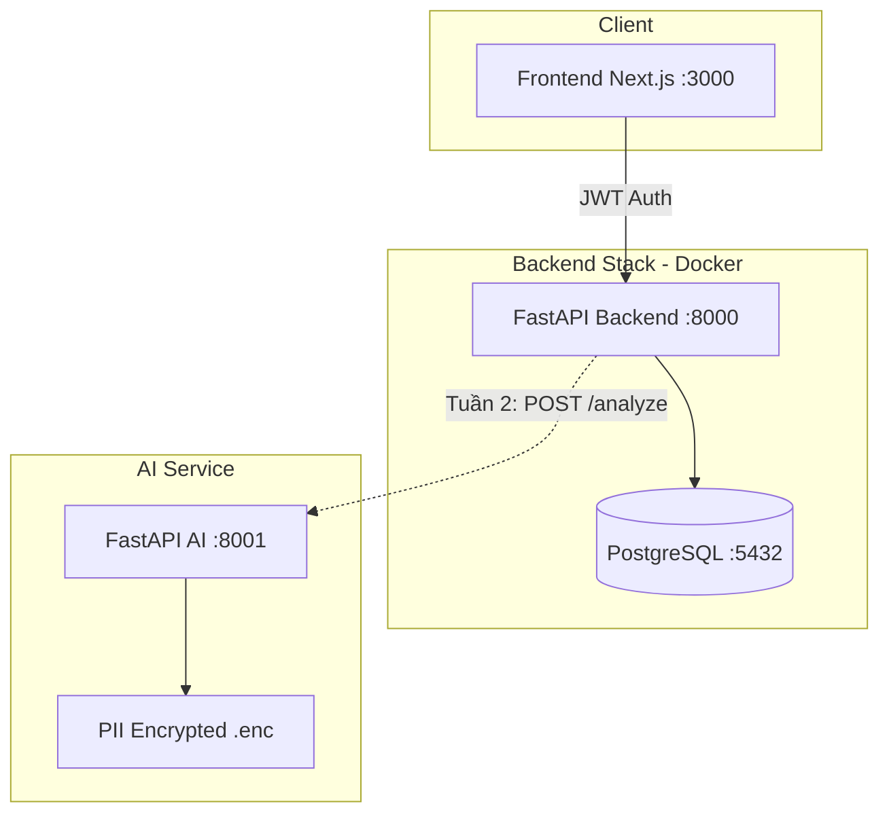

# Báo cáo công việc — C2-App-036 (TrustID AI / eKYC)

**Dự án:** Hệ thống eKYC phát hiện giả mạo khuôn mặt và giọng nói  
**Thời gian báo cáo:** 06/06/2026 – 13/06/2026 (cập nhật tới hôm nay)  
**Nhánh tham chiếu:** `main` (AI đã merge) · `dev` (Backend + Frontend mới nhất)  
**Ngày lập báo cáo:** 13/06/2026

---

## 1. Tổng quan

Sau báo cáo tuần 1 lần 1 (10/06), nhóm tiếp tục triển khai **nền tảng Backend** và **Frontend** song song với module AI đã hoàn thành. Tính tới 13/06/2026:

| Module | Trạng thái | Mô tả ngắn |
|--------|------------|------------|
| **AI Modules** (`code/ai_modules/`) | ✅ Hoàn thành | Pipeline giấy tờ, API port 8001, PII mã hóa — đã merge `main` (PR #7, #8) |
| **Backend** (`code/backend/`) | ✅ Hoàn thành (trên `dev`) | FastAPI + PostgreSQL + JWT + Docker + CRUD user admin |
| **Frontend** (`code/frontend/`) | 🟡 Đang chuyển đổi | Đã có UI login/logout từ template; đang migrate sang Next.js 16 |
| **Tích hợp E2E** (Backend ↔ AI) | ⬜ Chưa bắt đầu | Contract `BACKEND_API.md` đã sẵn sàng |

**Milestone Git:**

- `main`: merge AI module (PR #8, 12/06/2026)
- `dev`: merge Backend (PR #3) và Frontend base (PR #6), chưa merge vào `main`

---

## 2. Công việc Backend — 7 hạng mục đã triển khai

Nhóm Backend dựa trên **FastAPI Full-Stack Template**, tùy biến cho dự án eKYC. Code nằm trên nhánh `dev` / `feature/backend`.

### 2.1. Login, Logout — mật khẩu hash bcrypt

| Thành phần | Chi tiết |
|------------|----------|
| Hash mật khẩu | `pwdlib` hỗ trợ **Bcrypt** và Argon2; mặc định hash bằng bcrypt khi tạo user |
| Login | `POST /api/v1/login/access-token` — OAuth2 form (email + password) |
| Logout | Stateless JWT — client xóa `access_token`; không cần endpoint server |
| Đổi mật khẩu | `PATCH /api/v1/users/me/password` |
| Khôi phục mật khẩu | `POST /api/v1/password-recovery/{email}`, `POST /api/v1/reset-password/` |

File chính: `code/backend/app/core/security.py`, `code/backend/app/api/routes/login.py`

### 2.2. JWT — Authentication vs Authorization

| Khái niệm | Triển khai |
|-----------|------------|
| **Authentication** (xác thực) | JWT HS256, payload `{ sub: user_id, exp }`, ký bằng `SECRET_KEY` |
| **Authorization** (phân quyền) | Dependency `get_current_user` — decode token, load user từ DB |
| **Superuser** | `get_current_active_superuser` — chỉ `is_superuser=True` mới truy cập CRUD admin |
| **Token header** | `Authorization: Bearer <access_token>` qua `OAuth2PasswordBearer` |

Phân tách rõ:

- **Authentication:** `POST /login/access-token` → trả JWT
- **Authorization:** mỗi route protected dùng `Depends(get_current_user)` hoặc `get_current_active_superuser`

File chính: `code/backend/app/api/deps.py`, `code/backend/app/core/security.py`

### 2.3. Docker — build FastAPI, gọi dependency

| Thành phần | Chi tiết |
|------------|----------|
| `code/backend/Dockerfile` | Python 3.10, `uv` sync dependencies, `fastapi run --workers 4` |
| `code/compose.yml` | Orchestration: `db` → `prestart` → `backend` → `frontend` |
| `code/compose.override.yml` | Dev: hot-reload, mount source code |
| Prestart | `scripts/prestart.sh` — chờ DB healthy, chạy Alembic migrate, seed superuser |
| CI | `.github/workflows/test-docker-compose.yml` — test stack Docker |

Luồng khởi động:

```
docker compose up
  → PostgreSQL (healthcheck)
  → prestart (migrate + init data)
  → backend (FastAPI :8000)
  → frontend (nginx :80)
```

### 2.4. Database — PostgreSQL

| Thành phần | Chi tiết |
|------------|----------|
| Engine | PostgreSQL 18 (Docker image `postgres:18`) |
| ORM | SQLModel + SQLAlchemy |
| Migration | Alembic — 5 versions (User, Item, UUID, cascade delete, created_at) |
| Models | `User` (email, hashed_password, is_active, is_superuser, full_name), `Item` |
| Admin DB UI | Adminer (qua Traefik, môi trường staging/production) |
| Seed | Tự tạo superuser từ `FIRST_SUPERUSER` / `FIRST_SUPERUSER_PASSWORD` |

Connection string: `POSTGRES_SERVER`, `POSTGRES_PORT`, `POSTGRES_DB`, `POSTGRES_USER`, `POSTGRES_PASSWORD`

### 2.5. Giao diện quản lý API — Swagger

| Endpoint | Mô tả |
|----------|-------|
| `http://localhost:8000/docs` | Swagger UI — tương tác trực tiếp mọi API |
| `http://localhost:8000/api/v1/openapi.json` | OpenAPI schema |
| Authorize | Nhập JWT từ `/login/access-token` để test API protected |

FastAPI tự sinh tài liệu từ Pydantic models và route decorators.

### 2.6. API CRUD User (dành cho Admin)

Chỉ **superuser** mới gọi được (dependency `get_current_active_superuser`):

| Method | Endpoint | Chức năng |
|--------|----------|-----------|
| `GET` | `/api/v1/users/` | Danh sách user (phân trang skip/limit) |
| `POST` | `/api/v1/users/` | Tạo user mới |
| `GET` | `/api/v1/users/{user_id}` | Chi tiết user |
| `PATCH` | `/api/v1/users/{user_id}` | Cập nhật user |
| `DELETE` | `/api/v1/users/{user_id}` | Xóa user (kèm cascade items) |

User thường:

| Method | Endpoint | Chức năng |
|--------|----------|-----------|
| `GET` | `/api/v1/users/me` | Thông tin bản thân |
| `PATCH` | `/api/v1/users/me` | Cập nhật profile |
| `DELETE` | `/api/v1/users/me` | Xóa tài khoản |
| `POST` | `/api/v1/users/signup` | Đăng ký (môi trường local) |

**Kiểm thử:** `test_login.py`, `test_users.py` (521 dòng), `test_items.py` — chạy qua `scripts/test.sh` hoặc Docker.

---

## 3. Công việc Frontend

### 3.1. Giao diện Login / Logout

Nhóm Frontend đã triển khai **2 giai đoạn**:

**Giai đoạn 1 — React + Vite (commit `efa88df`, 10/06):**

- Trang `/login` — form email/password, gọi `POST /login/access-token`
- Hook `useAuth` — `loginMutation`, `logout()` (xóa `access_token` khỏi localStorage)
- Trang `/signup`, `/recover-password`, `/reset-password`
- Dashboard sau login, sidebar user menu có nút Logout
- Trang Admin quản lý user (`/admin`) — Add/Edit/Delete user
- E2E tests: `login.spec.ts`, `admin.spec.ts`, `sign-up.spec.ts`

**Giai đoạn 2 — Next.js 16 (commit `d7b6886`, nhánh `dev`):**

- Migrate sang **Next.js App Router** + Tailwind CSS 4 + React 19
- Cấu trúc: `app/layout.tsx`, `app/page.tsx`, placeholder `app/login/`, `app/dashboard/`, `features/auth/`
- **Trạng thái hiện tại:** scaffold Next.js; UI login/logout cần port lại từ giai đoạn 1

### 3.2. Swagger / API docs

- **Backend Swagger:** `http://localhost:8000/docs` — dùng để dev/test API
- **Frontend client:** template cũ có `openapi-ts` generate TypeScript SDK (`src/client/`) — sẽ tái sử dụng khi nối Next.js với Backend

---

## 4. Module AI (đã merge `main`)

Không thay đổi lớn kể từ báo cáo lần 1; tóm tắt:

```
Ảnh giấy tờ → Quality Check → OCR → Parse (CCCD/GPLX/Passport) → Face Extract → JSON + PII mã hóa
```

| Endpoint | Port | Mô tả |
|----------|------|-------|
| `POST /api/v1/document/analyze` | 8001 | Phân tích giấy tờ (compact/full) |
| `GET /api/v1/document/records/{id}` | 8001 | Đọc PII nội bộ (API key) |
| `GET /health` | 8001 | Health check |

- 12/12 unit tests pass
- PII lưu Fernet tại `code/data/private/records/*.enc`
- Tài liệu tích hợp: `code/ai_modules/docs/BACKEND_API.md`

---

## 5. Kiến trúc hệ thống hiện tại



| Service | Port | Công nghệ |
|---------|------|-----------|
| Frontend | 3000 (dev) / 80 (Docker) | Next.js 16, Tailwind 4 |
| Backend | 8000 | FastAPI, SQLModel, JWT, bcrypt |
| AI Service | 8001 | FastAPI, EasyOCR, InsightFace |
| Database | 5432 | PostgreSQL 18 |

---

## 6. Biến môi trường chính

| Biến | Service | Mô tả |
|------|---------|-------|
| `SECRET_KEY` | Backend | Ký JWT |
| `POSTGRES_*` | Backend | Kết nối PostgreSQL |
| `FIRST_SUPERUSER` / `FIRST_SUPERUSER_PASSWORD` | Backend | Tài khoản admin mặc định |
| `BACKEND_CORS_ORIGINS` | Backend | CORS cho Frontend |
| `EKYC_PRIVATE_STORAGE_KEY` | AI | Mã hóa PII (bắt buộc) |
| `EKYC_INTERNAL_API_KEY` | AI | API đọc PII nội bộ |

---

## 7. Git & Pull Request

| Ngày | PR / Commit | Mô tả |
|------|-------------|-------|
| 10/06 | `efa88df` | Backend: FastAPI template, Dockerfile, CI/CD |
| 10/06 | PR #3 | Merge `feature/backend` → `dev` |
| 10/06 | `9b22e19` | Frontend: feature/auth scaffold |
| 10/06 | `d7b6886` | Frontend: base Next.js |
| 10/06 | PR #6 | Merge `feature/frontend` → `dev` |
| 10/06 | PR #7, #8 | Merge AI module → `main` |
| 12/06 | `521400b` | Cập nhật báo cáo tuần 1 |

**Trạng thái nhánh (13/06):**

- `main`: AI module + báo cáo (5 commit ahead so với `dev` về AI)
- `dev`: Backend + Frontend mới (7 commit chưa merge vào `main`)
- Cần merge `dev` → `main` để đồng bộ toàn bộ codebase

---

## 8. Checklist 7 hạng mục (theo yêu cầu)

| # | Hạng mục | Backend | Frontend | Ghi chú |
|---|----------|---------|----------|---------|
| 1 | Login/Logout + bcrypt | ✅ | 🟡 | BE xong; FE có UI ở template Vite, đang port sang Next.js |
| 2 | JWT (auth vs authz) | ✅ | 🟡 | BE xong; FE lưu token localStorage (template cũ) |
| 3 | Docker | ✅ | ✅ | `compose.yml` + Dockerfile backend/frontend |
| 4 | PostgreSQL | ✅ | — | Alembic migrate, SQLModel models |
| 5 | Giao diện login/logout | — | 🟡 | UI hoàn chỉnh ở template; Next.js đang scaffold |
| 6 | Swagger quản lý API | ✅ | — | `/docs` trên Backend :8000 |
| 7 | CRUD user (admin) | ✅ | 🟡 | API xong; UI admin ở template Vite |

---

## 9. Vấn đề / rủi ro

| Vấn đề | Mức độ | Hướng xử lý |
|--------|--------|-------------|
| `dev` chưa merge vào `main` | Trung bình | Tạo PR merge `dev` → `main`, resolve conflict nếu có |
| Frontend đổi stack Vite → Next.js | Trung bình | Port login/admin từ template cũ, generate OpenAPI client mới |
| Backend chưa gọi AI service | Cao | Tuần 2: proxy `POST /analyze`, lưu `record_id` |
| 2 FastAPI services (8000 + 8001) | Thấp | Thêm AI service vào `compose.yml` hoặc gọi qua HTTP |
| JWT stateless — không revoke token | Thấp | Chấp nhận cho PoC; cân nhắc refresh token sau |

---

## 10. Kế hoạch tuần 2 (đề xuất)

1. **Merge `dev` → `main`** — đồng bộ Backend + Frontend vào nhánh chính
2. **Frontend:** hoàn thiện trang Login/Logout/Dashboard trên Next.js, nối API Backend
3. **Backend:** endpoint upload giấy tờ → proxy sang AI service (`BACKEND_API.md`)
4. **Docker:** thêm service `ai_modules` vào compose, cấu hình env `EKYC_*`
5. **E2E:** Client upload ảnh → Backend → AI → hiển thị warnings/quality score
6. **Tinh chỉnh parser AI** với ảnh CCCD/GPLX thật

---

## 11. Tóm tắt

Tới **13/06/2026**, dự án C2-App-036 đã có **3 trụ cột**:

1. **AI Module** — pipeline giấy tờ hoàn chỉnh, sẵn sàng tích hợp (đã trên `main`)
2. **Backend** — xác thực JWT, bcrypt, PostgreSQL, Docker, Swagger, CRUD user admin (trên `dev`)
3. **Frontend** — đang chuyển từ React/Vite sang Next.js; UI auth đã có prototype, cần hoàn thiện trên stack mới

**Việc cần làm ngay:** merge nhánh `dev`, port giao diện login/admin sang Next.js, và bắt đầu tích hợp Backend ↔ AI Service theo contract tuần 1.

---

*Báo cáo lần 1 (chi tiết AI): `Report/Week 1/Report_week1.md`*  
*Worklog kỹ thuật: `WORKLOG.md`*
