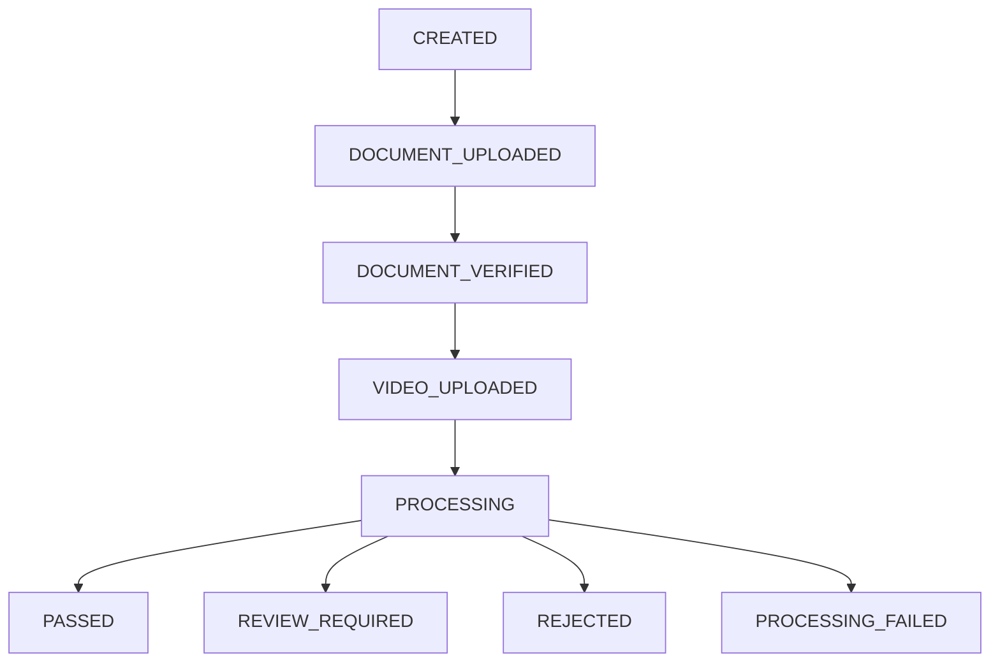

# PRODUCT REQUIREMENTS DOCUMENT — TRUSTID AI

## 1. Tổng quan sản phẩm

TrustID AI là web application hỗ trợ doanh nghiệp thực hiện xác minh danh tính trực tuyến và phát hiện các dấu hiệu giả mạo trong quá trình eKYC.

Hệ thống sử dụng giấy tờ tùy thân, video selfie và giọng nói để tạo một báo cáo rủi ro gồm:

- Kết quả OCR.
- Chất lượng giấy tờ.
- Face matching.
- Liveness.
- Deepfake video score.
- Voice spoofing score.
- Risk score tổng hợp.
- Các lý do cảnh báo.

## 2. Mục tiêu sản phẩm

### Mục tiêu chính

- Xây dựng được luồng eKYC hoàn chỉnh trên web.
- Phát hiện các hồ sơ có dấu hiệu giả mạo.
- Hỗ trợ nhân viên kiểm duyệt ra quyết định.
- Giải thích được nguyên nhân hồ sơ bị cảnh báo.

### Non-goals

- Không thay thế hoàn toàn nhân viên risk.
- Không sử dụng như quyết định pháp lý tự động.
- Không cam kết đạt chuẩn production của ngân hàng.
- Không xác minh giấy tờ với cơ sở dữ liệu chính phủ.
- Không huấn luyện model lớn từ đầu.

## 3. User Stories

### End User

- Là người dùng, tôi muốn chọn đúng loại giấy tờ để hệ thống hướng dẫn tôi upload.
- Tôi muốn biết ảnh giấy tờ có bị mờ hoặc lóa trước khi gửi.
- Tôi muốn nhận đoạn văn bản ngẫu nhiên để đọc khi quay video.
- Tôi muốn biết video đã ghi đủ khuôn mặt và giọng nói hay chưa.
- Tôi muốn biết hồ sơ đang xử lý, đã hoàn thành hay cần thực hiện lại.
- Tôi muốn nhận lý do dễ hiểu nếu hồ sơ không đạt.

### Risk Officer

- Là nhân viên kiểm duyệt, tôi muốn xem danh sách phiên eKYC.
- Tôi muốn lọc hồ sơ theo trạng thái và mức rủi ro.
- Tôi muốn xem thông tin OCR và bằng chứng liên quan.
- Tôi muốn xem từng score của hệ thống AI.
- Tôi muốn biết hệ thống cảnh báo vì lý do gì.
- Tôi muốn duyệt, từ chối hoặc yêu cầu người dùng xác minh lại.

### Administrator

- Tôi muốn xem trạng thái của các dịch vụ.
- Tôi muốn kiểm tra log khi một hồ sơ xử lý thất bại.
- Tôi muốn thay đổi ngưỡng phân loại trong môi trường thử nghiệm.

## 4. Quy trình nghiệp vụ chính

**Bước 1: Khởi tạo phiên eKYC**  
Hệ thống tạo một session_id và trạng thái CREATED.

**Bước 2: Chọn loại giấy tờ**  
Người dùng chọn:

- CCCD.
- Passport.
- Driving License.

**Bước 3: Upload giấy tờ**  
Hệ thống kiểm tra:

- Có file hợp lệ hay không.
- Định dạng file.
- Kích thước file.
- Blur.
- Brightness.
- Contrast.
- Glare.
- Có phát hiện vùng giấy tờ hay không.

Nếu không đạt, hệ thống trả về lý do và cho phép upload lại.

**Bước 4: OCR và trích xuất khuôn mặt**  
Hệ thống:

- Nhận dạng chữ.
- Chuẩn hóa các trường thông tin.
- Trích xuất ảnh chân dung.
- Lưu kết quả vào phiên eKYC.

**Bước 5: Tạo thử thách liveness**  
Hệ thống sinh đoạn văn bản hoặc yêu cầu ngẫu nhiên, ví dụ:

- Đọc một dãy số.
- Quay đầu sang trái.
- Quay đầu sang phải.
- Chớp mắt.

Trong MVP, có thể chọn một đến hai thử thách đơn giản.

**Bước 6: Thu video selfie**  
Người dùng quay hoặc upload video theo hướng dẫn.  
Hệ thống kiểm tra:

- Thời lượng video.
- Có khuôn mặt trong video.
- Khuôn mặt không bị che quá nhiều.
- Có audio.
- Chất lượng frame đủ để xử lý.

**Bước 7: AI processing**  
Hệ thống thực hiện:

1. Face detection.
2. Face quality check.
3. Face matching.
4. Passive hoặc challenge-based liveness.
5. Deepfake video detection.
6. Audio extraction.
7. Speech verification cơ bản.
8. Voice spoofing detection.
9. Risk scoring.

**Bước 8: Tổng hợp kết quả**  
Kết quả được phân thành:

- PASSED
- REVIEW_REQUIRED
- REJECTED
- PROCESSING_FAILED

**Bước 9: Manual review**  
Risk officer xem bằng chứng và thực hiện:

- Approve.
- Reject.
- Request resubmission.

## 5. Yêu cầu chức năng

**FR-01 — Tạo phiên eKYC**

- Hệ thống tạo session ID duy nhất.
- Ghi nhận thời gian tạo.
- Trạng thái ban đầu là CREATED.

**Acceptance criteria:**

- API trả về session ID.
- Session được lưu trong database.
- Có thể truy xuất session sau khi tạo.

**FR-02 — Chọn loại giấy tờ**

- Hỗ trợ CCCD, hộ chiếu và bằng lái xe.
- Giao diện thay đổi hướng dẫn theo từng loại giấy tờ.

**Acceptance criteria:**

- Người dùng không thể chuyển bước nếu chưa chọn loại giấy tờ.
- Loại giấy tờ được lưu vào session.

**FR-03 — Upload giấy tờ**

- Hỗ trợ JPG, JPEG và PNG.
- Giới hạn dung lượng theo cấu hình.
- CCCD và bằng lái xe hỗ trợ mặt trước, mặt sau.
- Passport hỗ trợ trang thông tin cá nhân.

**Acceptance criteria:**

- File không hợp lệ bị từ chối.
- File hợp lệ được lưu vào object storage.
- Database chỉ lưu đường dẫn và metadata cần thiết.

**FR-04 — Document Quality Check**  
Hệ thống kiểm tra:

- Blur.
- Brightness.
- Contrast.
- Glare.
- Document contour.
- Tỷ lệ giấy tờ trong ảnh.

**Acceptance criteria:**

- Mỗi tiêu chí có score hoặc trạng thái.
- Kết quả trả về danh sách lỗi.
- Người dùng được phép chụp hoặc upload lại.

**FR-05 — OCR**  
Hệ thống trích xuất các trường tùy loại giấy tờ.  
Ví dụ CCCD:

- Họ và tên.
- Số định danh.
- Ngày sinh.
- Giới tính.
- Quốc tịch.
- Quê quán.
- Nơi thường trú.
- Ngày hết hạn.

**Acceptance criteria:**

- Có raw OCR text.
- Có structured fields.
- Mỗi field có thể kèm confidence.
- Cho phép hiển thị “Không đọc được” khi confidence thấp.

**FR-06 — Face Extraction**

- Trích xuất ảnh khuôn mặt từ giấy tờ.
- Kiểm tra có đúng một khuôn mặt chính.

**Acceptance criteria:**

- Lưu được face crop.
- Trả lỗi khi không tìm thấy khuôn mặt.
- Trả cảnh báo khi khuôn mặt quá nhỏ hoặc quá mờ.

**FR-07 — Challenge Generation**

- Sinh đoạn text hoặc hành động ngẫu nhiên.
- Challenge gắn với session ID.
- Challenge có thời hạn.

**Acceptance criteria:**

- Mỗi phiên có challenge riêng.
- Nội dung challenge hiển thị trước khi quay.
- Challenge được lưu để kiểm tra lại.

**FR-08 — Video Selfie Capture**

- Cho phép quay video bằng camera trình duyệt hoặc upload video.
- Hiển thị bộ đếm thời gian.
- Hiển thị hướng dẫn vị trí khuôn mặt.

**Acceptance criteria:**

- Video đủ thời lượng mới được gửi.
- Video không có khuôn mặt bị từ chối.
- Video không có audio được cảnh báo.

**FR-09 — Face Matching**

- So sánh embedding khuôn mặt trên giấy tờ và video.
- Trả về similarity score.
- So sánh với threshold cấu hình.

**Acceptance criteria:**

- Có score từ model.
- Có trạng thái match hoặc mismatch.
- Threshold được ghi lại cùng kết quả để phục vụ audit.

**FR-10 — Liveness Detection**  
Hệ thống kiểm tra dấu hiệu người thật thông qua:

- Passive anti-spoofing.
- Chuyển động khuôn mặt.
- Blink hoặc head movement nếu áp dụng challenge.

**Acceptance criteria:**

- Trả về liveness score.
- Có lý do khi không đạt.
- Không chỉ dựa vào một frame duy nhất nếu video có nhiều frame.

**FR-11 — Deepfake Video Detection**

- Lấy mẫu frame từ video.
- Chạy pretrained deepfake detector.
- Tổng hợp score trên nhiều frame.

**Acceptance criteria:**

- Trả về deepfake probability hoặc authenticity score.
- Lưu số frame đã phân tích.
- Hiển thị cảnh báo khi score vượt ngưỡng.

**FR-12 — Voice Spoofing Detection**

- Trích xuất audio.
- Kiểm tra audio có tồn tại.
- Chạy pretrained anti-spoofing model hoặc phương pháp được nhóm lựa chọn.

**Acceptance criteria:**

- Trả về voice spoof score.
- Phân biệt được ít nhất audio thật và một số audio replay/synthetic trong tập test.
- Khi audio không đủ chất lượng, trả về INCONCLUSIVE, không tự động kết luận giả mạo.

**FR-13 — Risk Scoring**  
Risk score được tổng hợp từ:

- Document quality.
- OCR confidence.
- Face match.
- Liveness.
- Deepfake score.
- Voice spoof score.

Ví dụ logic MVP:

- Face mismatch nghiêm trọng → Reject.
- Liveness thấp → Review hoặc Reject.
- Deepfake score cao → Review Required.
- Nhiều tín hiệu rủi ro cùng xuất hiện → Reject.
- Tất cả score đạt → Passed.

**Acceptance criteria:**

- Có risk score từ 0–100 hoặc mức Low/Medium/High.
- Có danh sách reason codes.
- Không chỉ hiển thị một kết quả pass/fail không giải thích.

**FR-14 — Dashboard**  
Dashboard hiển thị:

- Tổng số hồ sơ.
- Số hồ sơ Passed.
- Số hồ sơ Review Required.
- Số hồ sơ Rejected.
- Danh sách session.
- Bộ lọc theo trạng thái và risk level.

**Acceptance criteria:**

- Có thể mở trang chi tiết từng session.
- Có thể lọc danh sách.
- Thông tin nhạy cảm được che một phần khi hiển thị danh sách.

**FR-15 — Manual Review**  
Risk officer có thể:

- Approve.
- Reject.
- Request resubmission.
- Ghi chú lý do.

**Acceptance criteria:**

- Mọi quyết định được lưu thời gian và người thao tác.
- Không được thay đổi kết quả mà không lưu audit record.

## 6. Yêu cầu phi chức năng

### Hiệu năng

- API upload phản hồi trạng thái rõ ràng.
- Một hồ sơ test mục tiêu xử lý trong dưới 60 giây.
- Có progress hoặc polling khi xử lý lâu.

### Bảo mật

- Không public trực tiếp file giấy tờ.
- Sử dụng URL có giới hạn hoặc API có xác thực.
- Che một phần số định danh trên dashboard.
- Không ghi ảnh giấy tờ hoặc token vào log.
- Secrets được lưu trong .env, không commit lên Git.

### Quyền riêng tư

- Chỉ thu thập dữ liệu phục vụ demo.
- Có thông báo đồng ý trước khi quay video.
- Có chính sách xóa dữ liệu test.
- Không sử dụng dữ liệu người dùng để train nếu chưa được đồng ý.

### Khả năng giải thích

- Mỗi quyết định phải có reason code.
- Hiển thị score theo từng module.
- Tránh khẳng định chắc chắn “đây là deepfake” khi model chỉ đưa ra xác suất.

### Khả năng bảo trì

- Các module AI được tách thành service.
- Threshold được cấu hình ngoài code.
- Có logging và error handling.
- Có API documentation qua Swagger/OpenAPI.

## 7. Dữ liệu chính

### EKYCSession

- session_id
- document_type
- status
- risk_level
- final_decision
- created_at
- updated_at

### DocumentResult

- document_path
- quality_scores
- raw_ocr_text
- parsed_fields
- document_face_path
- ocr_confidence

### BiometricResult

- video_path
- audio_path
- face_match_score
- liveness_score
- deepfake_score
- voice_spoof_score
- risk_score
- reason_codes

### ReviewResult

- reviewer
- action
- note
- reviewed_at

## 8. Trạng thái phiên

## 9. Tiêu chí nghiệm thu MVP

MVP được xem là hoàn thành khi:

1. Người dùng tạo được phiên eKYC.
2. Upload được một trong ba loại giấy tờ.
3. Hệ thống kiểm tra chất lượng ảnh.
4. Hệ thống OCR được thông tin cơ bản.
5. Hệ thống trích xuất được khuôn mặt trên giấy tờ.
6. Người dùng quay hoặc upload được video selfie.
7. Hệ thống trích xuất được khuôn mặt và audio từ video.
8. Có face matching score.
9. Có liveness score.
10. Có deepfake score.
11. Có voice spoof score hoặc trạng thái INCONCLUSIVE.
12. Có risk score tổng hợp.
13. Dashboard xem được danh sách và chi tiết hồ sơ.
14. Risk officer thực hiện được quyết định manual review.
15. Web được deploy và có video demo end-to-end.

## 10. Kế hoạch 4 tuần

### Tuần 1 — Document Pipeline

- Project setup.
- Database và object storage.
- Document upload UI/API.
- Quality check.
- OCR.
- Face extraction.

### Tuần 2 — Biometric Pipeline

- Video capture/upload.
- Frame và audio extraction.
- Face matching.
- Liveness detection.
- Challenge flow.

### Tuần 3 — Deepfake và Risk Engine

- Deepfake video model.
- Voice spoofing model.
- Risk scoring.
- Dashboard phiên bản đầu.
- Tích hợp toàn bộ pipeline.

### Tuần 4 — Hoàn thiện sản phẩm

- Kiểm thử end-to-end.
- Điều chỉnh threshold.
- Error handling.
- Deploy.
- Viết tài liệu.
- Chuẩn bị demo và slide.
