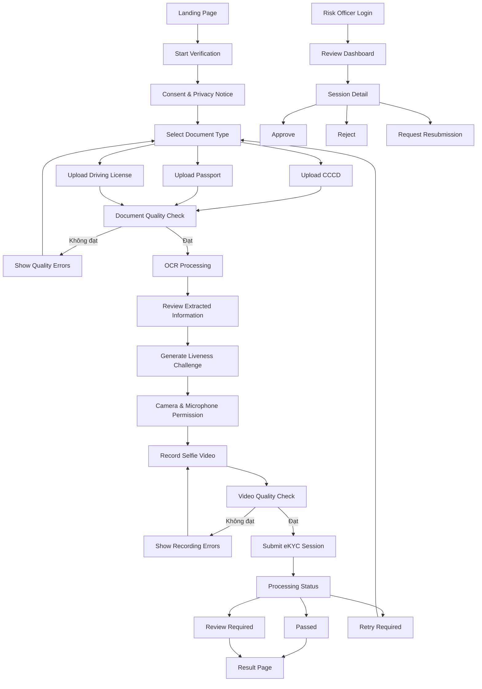
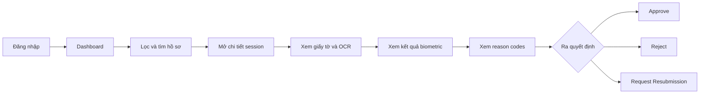
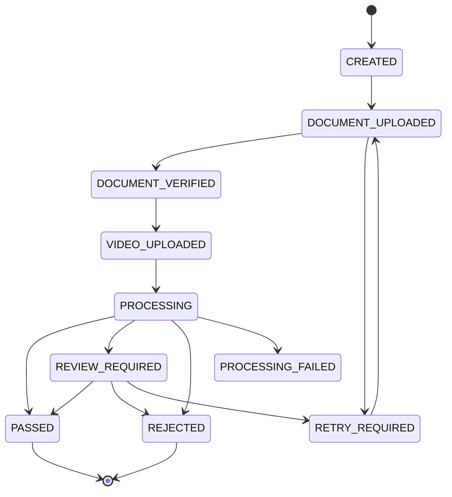

# WIREFRAME & UI FLOW — TRUSTID AI

## 1. Thông tin tài liệu

- **Tên dự án:** TrustID AI — Hệ thống eKYC phát hiện giả mạo khuôn mặt và giọng nói
- **Team:** C2-Team-036
- **Loại tài liệu:** Wireframe & UI Flow
- **Phiên bản:** 1.0
- **Phạm vi:** MVP trong 4 tuần

---

## 2. Mục tiêu thiết kế

Giao diện TrustID AI được chia thành hai nhóm người dùng chính:

1. **End User**
   - Thực hiện xác minh danh tính.
   - Tải giấy tờ.
   - Quay video selfie.
   - Nhận trạng thái hồ sơ.

2. **Risk Officer**
   - Theo dõi danh sách hồ sơ eKYC.
   - Xem kết quả OCR và AI.
   - Duyệt, từ chối hoặc yêu cầu xác minh lại.

Giao diện phía End User ưu tiên thiết bị di động. Dashboard phía Risk Officer ưu tiên màn hình desktop.

---

# 3. UI Flow tổng thể



---

# 4. User Flow phía End User

```mermaid
flowchart LR
    A[Trang bắt đầu]
    --> B[Đồng ý xử lý dữ liệu]
    --> C[Chọn loại giấy tờ]
    --> D[Tải ảnh giấy tờ]
    --> E[Kiểm tra chất lượng]
    --> F[Xác nhận thông tin OCR]
    --> G[Nhận thử thách liveness]
    --> H[Quay video selfie]
    --> I[Xem lại video]
    --> J[Gửi hồ sơ]
    --> K[Chờ xử lý]
    --> L[Nhận kết quả]
```



---

# 5. Wireframe phía End User

## 5.1. Screen 01 — Landing Page

### Mục đích

Giới thiệu quy trình eKYC và hướng dẫn người dùng chuẩn bị giấy tờ, camera và microphone.

### Wireframe

```text
┌──────────────────────────────────────────────────────────┐
│ TrustID AI                                      Trợ giúp │
├──────────────────────────────────────────────────────────┤
│                                                          │
│            XÁC MINH DANH TÍNH TRỰC TUYẾN                  │
│                                                          │
│  Hoàn thành xác minh bằng giấy tờ và video selfie.        │
│                                                          │
│  Bạn cần chuẩn bị:                                        │
│  ✓ CCCD, hộ chiếu hoặc bằng lái xe                        │
│  ✓ Camera và microphone                                   │
│  ✓ Khu vực đủ ánh sáng                                    │
│                                                          │
│               [ Bắt đầu xác minh ]                        │
│                                                          │
│  Thời gian dự kiến: 3–5 phút                              │
└──────────────────────────────────────────────────────────┘
```

### Thành phần giao diện

- Logo và tên sản phẩm.
- Tiêu đề xác minh danh tính.
- Mô tả ngắn quy trình.
- Danh sách thiết bị cần chuẩn bị.
- Nút `Bắt đầu xác minh`.
- Link `Trợ giúp`.

### Hành động

- Nhấn `Bắt đầu xác minh` để chuyển sang màn hình đồng ý xử lý dữ liệu.

---

## 5.2. Screen 02 — Consent & Privacy Notice

### Mục đích

Thông báo cho người dùng về các loại dữ liệu được thu thập và yêu cầu người dùng đồng ý trước khi bắt đầu.

### Wireframe

```text
┌──────────────────────────────────────────────────────────┐
│ ← Quay lại                              Bước 1/5          │
├──────────────────────────────────────────────────────────┤
│                ĐỒNG Ý XỬ LÝ DỮ LIỆU                       │
│                                                          │
│ Hệ thống cần thu thập:                                    │
│ • Ảnh giấy tờ                                             │
│ • Hình ảnh khuôn mặt                                      │
│ • Video và giọng nói                                      │
│                                                          │
│ Dữ liệu chỉ được sử dụng cho quá trình xác minh thử       │
│ nghiệm và được xử lý theo chính sách của hệ thống.        │
│                                                          │
│ [ ] Tôi đã đọc và đồng ý                                  │
│                                                          │
│                         [ Tiếp tục ]                       │
└──────────────────────────────────────────────────────────┘
```

### Thành phần giao diện

- Nút quay lại.
- Thanh tiến trình.
- Nội dung thông báo quyền riêng tư.
- Checkbox xác nhận.
- Nút `Tiếp tục`.

### Quy tắc

- Nút `Tiếp tục` bị vô hiệu hóa khi người dùng chưa tick checkbox.
- Có thể bổ sung link đến chính sách xử lý dữ liệu đầy đủ.

---

## 5.3. Screen 03 — Select Document Type

### Mục đích

Cho phép người dùng chọn loại giấy tờ sẽ sử dụng trong quá trình eKYC.

### Wireframe

```text
┌──────────────────────────────────────────────────────────┐
│ ← Quay lại                              Bước 2/5          │
├──────────────────────────────────────────────────────────┤
│              CHỌN LOẠI GIẤY TỜ                            │
│                                                          │
│  ┌────────────────┐ ┌────────────────┐ ┌────────────────┐ │
│  │      CCCD      │ │    Hộ chiếu    │ │  Bằng lái xe   │ │
│  │  Mặt trước/sau │ │ Trang thông tin│ │ Mặt trước/sau  │ │
│  └────────────────┘ └────────────────┘ └────────────────┘ │
│                                                          │
│                         [ Tiếp tục ]                       │
└──────────────────────────────────────────────────────────┘
```

### Thành phần giao diện

- Thẻ lựa chọn CCCD.
- Thẻ lựa chọn hộ chiếu.
- Thẻ lựa chọn bằng lái xe.
- Nút `Tiếp tục`.

### Quy tắc

- Người dùng chỉ được chọn một loại giấy tờ.
- Nút `Tiếp tục` chỉ hoạt động sau khi đã chọn loại giấy tờ.

---

## 5.4. Screen 04 — Document Upload

### Mục đích

Cho phép người dùng tải ảnh giấy tờ theo đúng loại đã chọn.

### Wireframe

```text
┌──────────────────────────────────────────────────────────┐
│ ← Quay lại                              Bước 2/5          │
├──────────────────────────────────────────────────────────┤
│                 TẢI ẢNH GIẤY TỜ                           │
│                                                          │
│  Mặt trước                                                │
│  ┌────────────────────────────────────────────────────┐   │
│  │                                                    │   │
│  │    Kéo thả ảnh hoặc [ Chọn ảnh ]                   │   │
│  │                                                    │   │
│  └────────────────────────────────────────────────────┘   │
│                                                          │
│  Mặt sau                                                  │
│  ┌────────────────────────────────────────────────────┐   │
│  │    Kéo thả ảnh hoặc [ Chọn ảnh ]                   │   │
│  └────────────────────────────────────────────────────┘   │
│                                                          │
│  Hướng dẫn: Không lóa, không mờ, đủ bốn góc giấy tờ.      │
│                                                          │
│                  [ Kiểm tra ảnh ]                         │
└──────────────────────────────────────────────────────────┘
```

### Thành phần giao diện

- Khu vực tải ảnh mặt trước.
- Khu vực tải ảnh mặt sau.
- Preview ảnh đã chọn.
- Nút xóa hoặc chọn lại ảnh.
- Hướng dẫn chất lượng ảnh.
- Nút `Kiểm tra ảnh`.

### Quy tắc

- Hỗ trợ JPG, JPEG và PNG.
- Kiểm tra dung lượng file.
- Passport chỉ yêu cầu trang thông tin cá nhân.
- CCCD và bằng lái xe yêu cầu mặt trước và mặt sau.

---

## 5.5. Screen 05 — Document Quality Result

### Trường hợp đạt

```text
┌──────────────────────────────────────────────────────────┐
│                  KIỂM TRA CHẤT LƯỢNG                      │
├──────────────────────────────────────────────────────────┤
│  ✓ Ảnh rõ nét                                             │
│  ✓ Độ sáng phù hợp                                        │
│  ✓ Không phát hiện vùng lóa nghiêm trọng                  │
│  ✓ Giấy tờ nằm đầy đủ trong ảnh                           │
│                                                          │
│                         [ Tiếp tục ]                       │
└──────────────────────────────────────────────────────────┘
```

### Trường hợp không đạt

```text
┌──────────────────────────────────────────────────────────┐
│                  ẢNH CHƯA ĐẠT YÊU CẦU                     │
├──────────────────────────────────────────────────────────┤
│  ✕ Ảnh mặt trước bị mờ                                    │
│  ✕ Góc phải của giấy tờ bị cắt                            │
│                                                          │
│  Gợi ý:                                                   │
│  • Đặt giấy tờ trên mặt phẳng                             │
│  • Giữ camera ổn định                                     │
│  • Tránh ánh sáng phản chiếu                              │
│                                                          │
│                  [ Tải ảnh khác ]                         │
└──────────────────────────────────────────────────────────┘
```

### Kết quả kiểm tra

Hệ thống có thể hiển thị các tiêu chí:

- Blur.
- Brightness.
- Contrast.
- Glare.
- Document contour.
- Tỷ lệ giấy tờ nằm trong ảnh.
- Kích thước ảnh.
- Khuôn mặt trên giấy tờ.

### Hành động

- Nếu đạt: chuyển sang OCR.
- Nếu không đạt: yêu cầu người dùng tải lại ảnh.

---

## 5.6. Screen 06 — OCR Review

### Mục đích

Hiển thị thông tin được trích xuất từ giấy tờ để người dùng kiểm tra.

### Wireframe

```text
┌──────────────────────────────────────────────────────────┐
│ ← Quay lại                              Bước 3/5          │
├──────────────────────────────────────────────────────────┤
│              KIỂM TRA THÔNG TIN                            │
│                                                          │
│  Họ và tên        [ NGUYEN VAN A                    ]      │
│  Số định danh     [ ********1234                    ]      │
│  Ngày sinh        [ 01/01/2000                      ]      │
│  Giới tính        [ Nam                             ]      │
│  Ngày hết hạn     [ 01/01/2035                      ]      │
│                                                          │
│  [ ] Tôi xác nhận các thông tin trên là chính xác         │
│                                                          │
│                         [ Tiếp tục ]                       │
└──────────────────────────────────────────────────────────┘
```

### Thành phần giao diện

- Họ và tên.
- Số giấy tờ được che một phần.
- Ngày sinh.
- Giới tính.
- Ngày hết hạn.
- Checkbox xác nhận.
- Nút `Tiếp tục`.

### Quy tắc

- Có thể cho phép sửa các trường OCR.
- Hệ thống phải lưu riêng:
  - Kết quả OCR gốc.
  - Thông tin người dùng đã chỉnh sửa.
- Trường có confidence thấp cần được đánh dấu.

---

## 5.7. Screen 07 — Liveness Challenge

### Mục đích

Hướng dẫn người dùng thực hiện thử thách để kiểm tra liveness.

### Wireframe

```text
┌──────────────────────────────────────────────────────────┐
│ ← Quay lại                              Bước 4/5          │
├──────────────────────────────────────────────────────────┤
│                XÁC MINH NGƯỜI THẬT                         │
│                                                          │
│  Khi quay video, vui lòng:                                │
│                                                          │
│  1. Nhìn thẳng vào camera                                 │
│  2. Quay đầu nhẹ sang trái rồi sang phải                  │
│  3. Đọc rõ đoạn mã:                                       │
│                                                          │
│                 “BẢY — HAI — CHÍN — BỐN”                  │
│                                                          │
│  Video dài khoảng 5–10 giây.                              │
│                                                          │
│                  [ Bắt đầu quay ]                         │
└──────────────────────────────────────────────────────────┘
```

### Loại thử thách MVP

- Đọc một dãy số ngẫu nhiên.
- Quay đầu sang trái.
- Quay đầu sang phải.
- Chớp mắt.

### Quy tắc

- Challenge được gắn với `session_id`.
- Challenge có thời hạn.
- Người dùng phải đọc đúng đoạn text đã được tạo cho phiên đó.

---

## 5.8. Screen 08 — Camera & Microphone Permission

### Mục đích

Yêu cầu quyền truy cập camera và microphone trước khi quay video.

### Wireframe

```text
┌──────────────────────────────────────────────────────────┐
│             CHO PHÉP CAMERA VÀ MICROPHONE                 │
├──────────────────────────────────────────────────────────┤
│                                                          │
│  TrustID AI cần truy cập camera và microphone để:         │
│                                                          │
│  • Ghi lại video selfie                                   │
│  • Thu giọng nói                                          │
│  • Kiểm tra liveness                                      │
│                                                          │
│            [ Cho phép camera và microphone ]              │
│                                                          │
│  Không thể tiếp tục nếu không cấp quyền.                  │
└──────────────────────────────────────────────────────────┘
```

### Trạng thái lỗi

- Camera bị từ chối.
- Microphone bị từ chối.
- Không tìm thấy thiết bị.
- Trình duyệt không hỗ trợ.

---

## 5.9. Screen 09 — Record Selfie Video

### Mục đích

Quay video selfie và thu âm giọng nói của người dùng.

### Wireframe

```text
┌──────────────────────────────────────────────────────────┐
│              ĐANG QUAY VIDEO — 00:06                      │
├──────────────────────────────────────────────────────────┤
│                                                          │
│             ┌─────────────────────────┐                   │
│             │                         │                   │
│             │       CAMERA VIEW       │                   │
│             │       Face Guide        │                   │
│             │                         │                   │
│             └─────────────────────────┘                   │
│                                                          │
│  Hãy đọc: “BẢY — HAI — CHÍN — BỐN”                       │
│                                                          │
│  ✓ Đã phát hiện khuôn mặt                                 │
│  ✓ Microphone đang hoạt động                              │
│                                                          │
│                    [ Dừng quay ]                          │
└──────────────────────────────────────────────────────────┘
```

### Thành phần giao diện

- Camera preview.
- Khung hướng dẫn vị trí khuôn mặt.
- Thời gian quay.
- Nội dung challenge.
- Trạng thái phát hiện khuôn mặt.
- Trạng thái microphone.
- Nút dừng quay.

### Kiểm tra thời gian thực

- Có khuôn mặt hay không.
- Khuôn mặt nằm trong khung hay không.
- Có nhiều khuôn mặt hay không.
- Mức âm thanh đầu vào.
- Thời lượng video.

---

## 5.10. Screen 10 — Video Preview

### Mục đích

Cho người dùng xem lại video trước khi gửi.

### Wireframe

```text
┌──────────────────────────────────────────────────────────┐
│                    KIỂM TRA VIDEO                         │
├──────────────────────────────────────────────────────────┤
│                                                          │
│             ┌─────────────────────────┐                   │
│             │       VIDEO PREVIEW     │                   │
│             └─────────────────────────┘                   │
│                                                          │
│  ✓ Có khuôn mặt                                           │
│  ✓ Có âm thanh                                            │
│  ✓ Thời lượng hợp lệ                                      │
│                                                          │
│       [ Quay lại ]             [ Gửi xác minh ]           │
└──────────────────────────────────────────────────────────┘
```

### Hành động

- `Quay lại`: xóa video hiện tại và quay video mới.
- `Gửi xác minh`: tải video lên hệ thống và bắt đầu xử lý.

---

## 5.11. Screen 11 — Processing Status

### Mục đích

Hiển thị trạng thái xử lý của từng bước trong pipeline.

### Wireframe

```text
┌──────────────────────────────────────────────────────────┐
│                 ĐANG XỬ LÝ HỒ SƠ                          │
├──────────────────────────────────────────────────────────┤
│                                                          │
│                    [ Loading ... ]                        │
│                                                          │
│  ✓ Kiểm tra giấy tờ                                       │
│  ✓ Trích xuất thông tin                                   │
│  ● Đang xác minh khuôn mặt                                │
│  ○ Đang kiểm tra liveness                                 │
│  ○ Đang kiểm tra deepfake                                 │
│  ○ Đang kiểm tra giọng nói                                │
│  ○ Đang tổng hợp kết quả                                  │
│                                                          │
│  Vui lòng không đóng trang trong khi hệ thống xử lý.      │
└──────────────────────────────────────────────────────────┘
```

### Các bước xử lý

1. Document quality check.
2. OCR.
3. Face extraction.
4. Face matching.
5. Liveness detection.
6. Deepfake video detection.
7. Voice spoofing detection.
8. Risk scoring.

### Cách cập nhật

- Polling API theo chu kỳ.
- WebSocket nếu nhóm có đủ thời gian.
- Hiển thị lỗi riêng cho từng module.

---

## 5.12. Screen 12 — User Result: Passed

```text
┌──────────────────────────────────────────────────────────┐
│                    XÁC MINH THÀNH CÔNG                    │
├──────────────────────────────────────────────────────────┤
│                         ✓                                │
│                                                          │
│  Hồ sơ của bạn đã hoàn thành xác minh.                    │
│  Mã hồ sơ: EKYC-2026-00036                                │
│                                                          │
│                      [ Hoàn tất ]                         │
└──────────────────────────────────────────────────────────┘
```

### Nội dung hiển thị

- Trạng thái thành công.
- Mã hồ sơ.
- Thời gian hoàn thành.
- Nút hoàn tất.

---

## 5.13. Screen 13 — User Result: Retry Required

```text
┌──────────────────────────────────────────────────────────┐
│                 CẦN THỰC HIỆN LẠI                         │
├──────────────────────────────────────────────────────────┤
│  Video chưa đạt yêu cầu vì:                               │
│                                                          │
│  • Khuôn mặt bị che trong nhiều khung hình                │
│  • Âm thanh không đủ rõ                                   │
│                                                          │
│                   [ Quay lại video ]                      │
└──────────────────────────────────────────────────────────┘
```

### Reason codes ví dụ

- `FACE_NOT_FOUND`
- `MULTIPLE_FACES`
- `FACE_TOO_SMALL`
- `LOW_VIDEO_QUALITY`
- `NO_AUDIO`
- `AUDIO_TOO_SHORT`
- `CHALLENGE_NOT_COMPLETED`

---

## 5.14. Screen 14 — User Result: Review Required

```text
┌──────────────────────────────────────────────────────────┐
│                   HỒ SƠ ĐANG ĐƯỢC KIỂM TRA                │
├──────────────────────────────────────────────────────────┤
│  Hệ thống cần kiểm tra thêm một số thông tin.             │
│                                                          │
│  Mã hồ sơ: EKYC-2026-00036                                │
│  Trạng thái: Đang chờ kiểm duyệt                          │
│                                                          │
│                      [ Hoàn tất ]                         │
└──────────────────────────────────────────────────────────┘
```

### Quy tắc hiển thị

- Không hiển thị trực tiếp các kết luận kỹ thuật như “deepfake probability”.
- Chỉ thông báo hồ sơ cần kiểm tra thêm.
- Người dùng không được xem các threshold nội bộ.

---

# 6. User Flow phía Risk Officer



---

# 7. Wireframe phía Risk Officer

## 7.1. Screen 15 — Risk Officer Login

### Mục đích

Cho phép nhân viên kiểm duyệt đăng nhập vào dashboard.

### Wireframe

```text
┌──────────────────────────────────────────────────────────┐
│                       TRUSTID AI                          │
├──────────────────────────────────────────────────────────┤
│                                                          │
│  Email       [                              ]             │
│  Password    [                              ]             │
│                                                          │
│                         [ Đăng nhập ]                     │
└──────────────────────────────────────────────────────────┘
```

### Thành phần giao diện

- Email.
- Password.
- Nút đăng nhập.
- Thông báo sai thông tin đăng nhập.

---

## 7.2. Screen 16 — Review Dashboard

### Mục đích

Hiển thị tổng quan và danh sách hồ sơ eKYC.

### Wireframe

```text
┌────────────────────────────────────────────────────────────────────┐
│ TrustID AI     Dashboard     Sessions     System      Risk Officer │
├────────────────────────────────────────────────────────────────────┤
│                                                                    │
│  Tổng hồ sơ       Passed         Review          Rejected          │
│  ┌──────────┐    ┌──────────┐   ┌──────────┐    ┌──────────┐       │
│  │   124    │    │    82    │   │    27    │    │    15    │       │
│  └──────────┘    └──────────┘   └──────────┘    └──────────┘       │
│                                                                    │
│  Tìm kiếm [____________]  Trạng thái [All ▼]  Risk [All ▼]        │
│                                                                    │
│  Session ID       Document   Risk     Status          Created      │
│  EKYC-00036       CCCD       High     Review          10:32        │
│  EKYC-00035       Passport   Low      Passed          10:15        │
│  EKYC-00034       CCCD       High     Rejected        09:58        │
│                                                                    │
│                         [ Xem chi tiết ]                            │
└────────────────────────────────────────────────────────────────────┘
```

### Chỉ số tổng quan

- Tổng số hồ sơ.
- Passed.
- Review Required.
- Rejected.
- Processing Failed.

### Bộ lọc

- Session ID.
- Loại giấy tờ.
- Trạng thái.
- Risk level.
- Khoảng thời gian.

### Thông tin trong bảng

- Session ID.
- Loại giấy tờ.
- Risk level.
- Trạng thái.
- Thời gian tạo.
- Hành động xem chi tiết.

---

## 7.3. Screen 17 — Session Detail

### Mục đích

Hiển thị toàn bộ thông tin và kết quả AI của một hồ sơ.

### Wireframe

```text
┌────────────────────────────────────────────────────────────────────┐
│ ← Sessions        EKYC-00036                 Risk: HIGH            │
├────────────────────────────────────────────────────────────────────┤
│                                                                    │
│  DOCUMENT                         OCR INFORMATION                   │
│  ┌────────────────────┐           Họ tên: NGUYEN VAN A              │
│  │ Document Preview   │           ID: ********1234                  │
│  │                    │           DOB: 01/01/2000                   │
│  └────────────────────┘           OCR confidence: 94%               │
│                                                                    │
│  BIOMETRIC RESULTS                                                  │
│  Face match               0.71      Warning                        │
│  Liveness                 0.84      Passed                         │
│  Deepfake probability     0.67      Warning                        │
│  Voice spoof probability  0.21      Passed                         │
│                                                                    │
│  REASON CODES                                                      │
│  • FACE_MATCH_BELOW_THRESHOLD                                      │
│  • DEEPFAKE_SCORE_HIGH                                             │
│                                                                    │
│  Reviewer note [______________________________________________]     │
│                                                                    │
│  [ Approve ]     [ Request Resubmission ]       [ Reject ]         │
└────────────────────────────────────────────────────────────────────┘
```

### Khu vực Document

- Preview ảnh giấy tờ.
- Loại giấy tờ.
- Document quality score.
- OCR raw text.
- Structured fields.
- Ảnh khuôn mặt trích xuất.

### Khu vực Biometric

- Video preview.
- Frame đại diện.
- Face match score.
- Liveness score.
- Deepfake probability.
- Voice spoof probability.
- Risk score tổng hợp.

### Khu vực Reason Codes

Ví dụ:

- `DOCUMENT_BLUR_HIGH`
- `OCR_CONFIDENCE_LOW`
- `FACE_MATCH_BELOW_THRESHOLD`
- `LIVENESS_SCORE_LOW`
- `DEEPFAKE_SCORE_HIGH`
- `VOICE_SPOOF_SCORE_HIGH`
- `MULTIPLE_RISK_SIGNALS`

### Hành động

- `Approve`
- `Reject`
- `Request Resubmission`

---

## 7.4. Screen 18 — Decision Confirmation Modal

### Mục đích

Xác nhận hành động trước khi cập nhật kết quả hồ sơ.

### Wireframe

```text
┌──────────────────────────────────────────────────────────┐
│                 XÁC NHẬN QUYẾT ĐỊNH                       │
├──────────────────────────────────────────────────────────┤
│                                                          │
│  Bạn đang chọn: REQUEST RESUBMISSION                      │
│                                                          │
│  Lý do:                                                   │
│  [____________________________________________________]   │
│  [____________________________________________________]   │
│                                                          │
│            [ Hủy ]             [ Xác nhận ]               │
└──────────────────────────────────────────────────────────┘
```

### Quy tắc

- Bắt buộc nhập lý do khi Reject hoặc Request Resubmission.
- Lưu reviewer, thời gian và nội dung ghi chú.
- Không xóa kết quả AI ban đầu.

---

# 8. Trạng thái hệ thống

| Trạng thái | Mô tả |
|---|---|
| `CREATED` | Phiên eKYC vừa được tạo |
| `DOCUMENT_UPLOADED` | Người dùng đã tải giấy tờ |
| `DOCUMENT_VERIFIED` | Giấy tờ đã qua kiểm tra chất lượng |
| `VIDEO_UPLOADED` | Video selfie đã được tải lên |
| `PROCESSING` | AI đang xử lý hồ sơ |
| `PASSED` | Hồ sơ vượt qua các kiểm tra |
| `REVIEW_REQUIRED` | Hồ sơ cần nhân viên kiểm tra |
| `REJECTED` | Hồ sơ bị từ chối |
| `RETRY_REQUIRED` | Người dùng cần thực hiện lại một bước |
| `PROCESSING_FAILED` | Pipeline gặp lỗi kỹ thuật |

---

# 9. Luồng trạng thái eKYC



---

# 10. Quy tắc responsive

## Mobile — End User

- Thiết kế theo chiều dọc.
- Nút chính chiếm toàn bộ chiều rộng.
- Camera preview hiển thị lớn.
- Hạn chế bảng dữ liệu.
- Các bước được hiển thị bằng progress bar.
- Font và nút đủ lớn để thao tác bằng ngón tay.

## Desktop — Risk Officer

- Sử dụng sidebar hoặc top navigation.
- Danh sách session hiển thị dạng bảng.
- Trang chi tiết chia thành nhiều khu vực.
- Preview giấy tờ và video đặt cạnh kết quả AI.
- Các nút quyết định luôn hiển thị rõ ràng.

---

# 11. Quy tắc màu sắc đề xuất

| Trạng thái | Màu đề xuất |
|---|---|
| Passed | Xanh lá |
| Processing | Xanh dương |
| Review Required | Vàng hoặc cam |
| Rejected | Đỏ |
| Retry Required | Cam |
| Processing Failed | Đỏ đậm hoặc xám |

> Lưu ý: Không chỉ sử dụng màu sắc để thể hiện trạng thái. Cần kèm icon và text để hỗ trợ khả năng truy cập.

---

# 12. Quy tắc bảo mật giao diện

- Che một phần số CCCD hoặc số hộ chiếu.
- Không hiển thị URL thật của file giấy tờ.
- Không cho phép người dùng khác truy cập session bằng cách đoán ID.
- Dashboard yêu cầu đăng nhập.
- Các thao tác Approve, Reject và Request Resubmission phải được ghi audit log.
- Không hiển thị access token hoặc dữ liệu nhạy cảm trong thông báo lỗi.
- Không lưu video hoặc ảnh trong local storage của trình duyệt lâu hơn cần thiết.

---

# 13. Empty State và Error State

## Empty State — Chưa có hồ sơ

```text
┌──────────────────────────────────────────────────────────┐
│                   CHƯA CÓ HỒ SƠ                           │
├──────────────────────────────────────────────────────────┤
│                                                          │
│  Hiện chưa có phiên eKYC nào phù hợp với bộ lọc.          │
│                                                          │
│                    [ Xóa bộ lọc ]                         │
└──────────────────────────────────────────────────────────┘
```

## Error State — Xử lý thất bại

```text
┌──────────────────────────────────────────────────────────┐
│               KHÔNG THỂ XỬ LÝ HỒ SƠ                       │
├──────────────────────────────────────────────────────────┤
│                                                          │
│  Hệ thống gặp lỗi trong quá trình xử lý.                  │
│  Mã lỗi: PROCESSING_FAILED                                │
│                                                          │
│            [ Thử lại ]       [ Liên hệ hỗ trợ ]           │
└──────────────────────────────────────────────────────────┘
```

---

# 14. Tiêu chí nghiệm thu Wireframe/UI Flow

Wireframe được xem là đạt yêu cầu khi:

1. Có đầy đủ luồng End User từ bắt đầu đến nhận kết quả.
2. Có đầy đủ luồng Risk Officer từ đăng nhập đến ra quyết định.
3. Có màn hình upload giấy tờ.
4. Có màn hình kiểm tra chất lượng ảnh.
5. Có màn hình xem kết quả OCR.
6. Có màn hình thử thách liveness.
7. Có màn hình quay video selfie.
8. Có màn hình processing.
9. Có các trạng thái Passed, Review Required và Retry Required.
10. Có dashboard danh sách hồ sơ.
11. Có trang chi tiết session.
12. Có các hành động Approve, Reject và Request Resubmission.
13. Có mô tả responsive cho mobile và desktop.
14. Có xử lý empty state và error state.
15. Có sơ đồ Mermaid mô tả UI Flow và trạng thái hệ thống.

---

# 15. Danh sách màn hình MVP

| ID | Màn hình | Người dùng |
|---|---|---|
| S01 | Landing Page | End User |
| S02 | Consent & Privacy Notice | End User |
| S03 | Select Document Type | End User |
| S04 | Document Upload | End User |
| S05 | Document Quality Result | End User |
| S06 | OCR Review | End User |
| S07 | Liveness Challenge | End User |
| S08 | Camera & Microphone Permission | End User |
| S09 | Record Selfie Video | End User |
| S10 | Video Preview | End User |
| S11 | Processing Status | End User |
| S12 | Result — Passed | End User |
| S13 | Result — Retry Required | End User |
| S14 | Result — Review Required | End User |
| S15 | Risk Officer Login | Risk Officer |
| S16 | Review Dashboard | Risk Officer |
| S17 | Session Detail | Risk Officer |
| S18 | Decision Confirmation Modal | Risk Officer |

---

# 16. Kết luận

Wireframe của TrustID AI mô tả đầy đủ hai luồng chính:

- Luồng người dùng thực hiện xác minh danh tính.
- Luồng nhân viên kiểm duyệt đánh giá và xử lý hồ sơ.

Trong phạm vi MVP 4 tuần, nhóm ưu tiên hoàn thiện các màn hình và chức năng cốt lõi, không tập trung vào hiệu ứng giao diện phức tạp. Mục tiêu chính là bảo đảm người dùng có thể hoàn thành toàn bộ quy trình eKYC và nhân viên kiểm duyệt có đủ thông tin để đưa ra quyết định.
